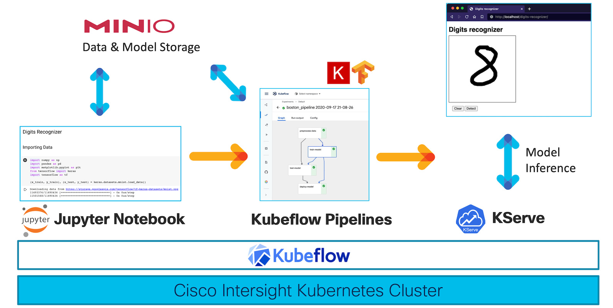

Recognizing Digits with Kubeflow
=====================================
MLOps Workflow Demo

This is a sample MLOps workflow featuring Kubeflow running on Cisco Intersight managed hardware. Deploy Kubeflow via Cisco Intersight and create a ML pipeline for a digit recognizer application.

## Related Sandbox
[Cisco Intersight](https://devnetsandbox.cisco.com/RM/Diagram/Index/a63216d2-e891-4856-9f27-309ca61ec862?diagramType=Topology)
