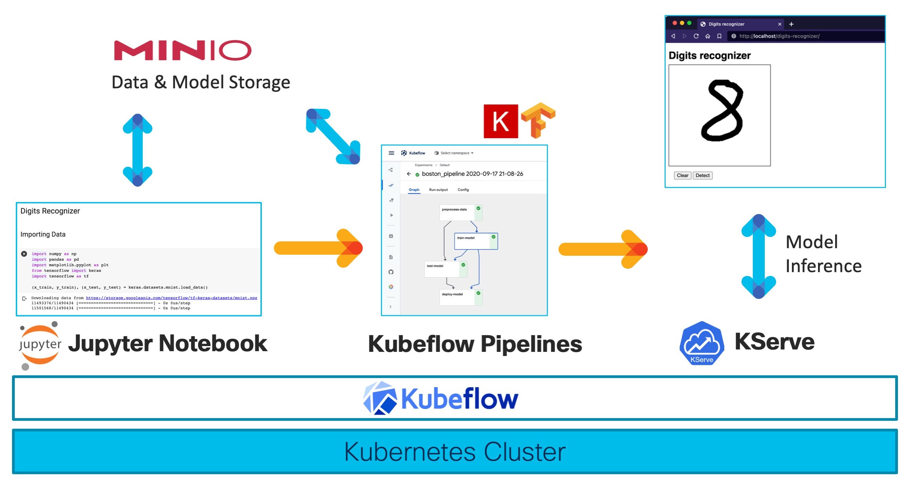
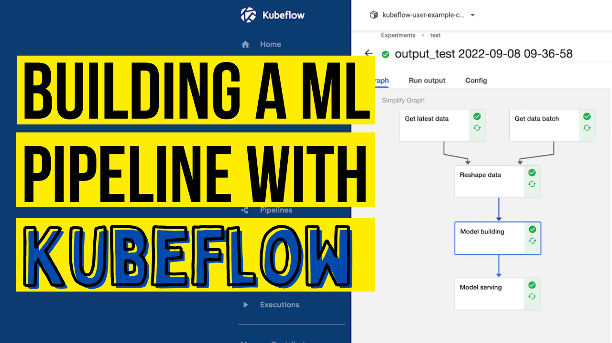
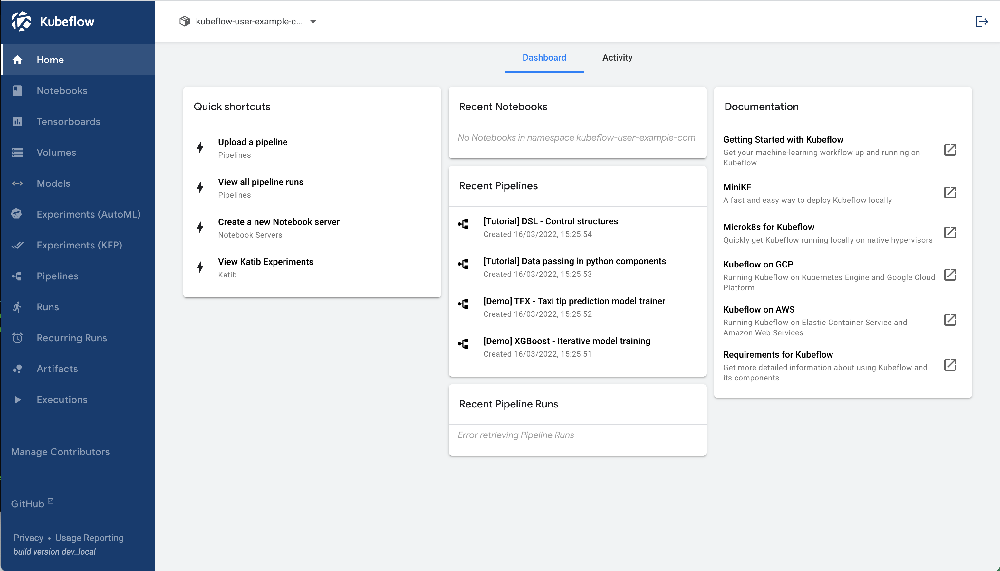
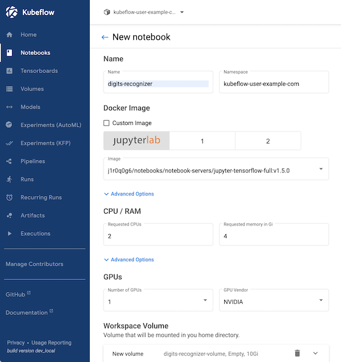
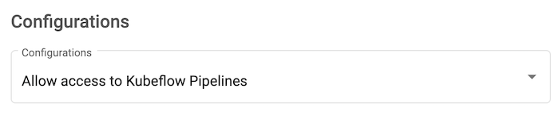
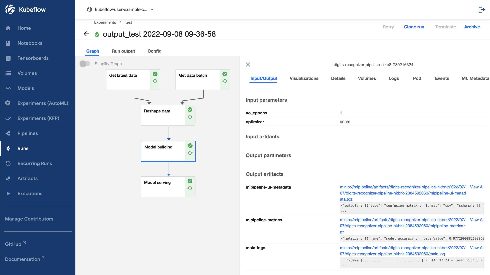
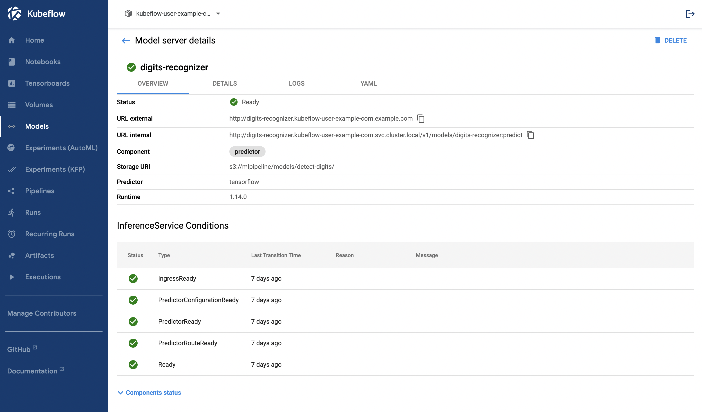
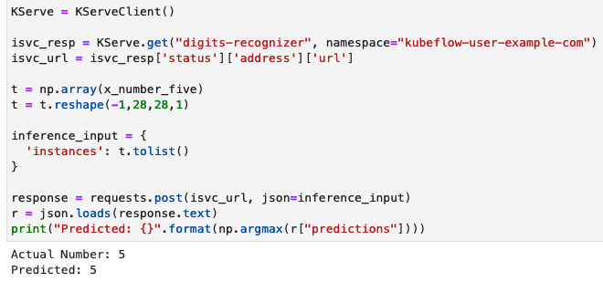

# MLOps Workflow: Recognizing Digits with Kubeflow

The [MNIST database of handwritten digits](http://yann.lecun.com/exdb/mnist/) is the Hello-World of deep learning and therefore the best example to focus not on the ML model itself, but on creating the ML pipeline. The goal here is to create an automated ML pipeline for getting the data, data pre-processing, and creating and serving the ML model. You can see an overview of the digits recognizer application below.



**You need to follow these steps**:

1. Deploy a Kubernetes Cluster and install Kubeflow
2. Access the Kubeflow Central Dashboard
3. Setup Jupyter Notebooks
4. Setup MinIO for Object Storage
5. Setting up Kserve
6. Create a ML pipeline with Kubeflow Pipelines
7. Test the model inference

**Used Components**:

* Kubeflow 1.5.1 - Notebook, Pipelines, Kserve
* MinIO
* Kubernetes 1.21
* Hardware: Cisco UCS Server

[](https://youtu.be/6wWdNg0GMV4)
*Check out the [Walk-through Video](https://youtu.be/6wWdNg0GMV4)!*


## 1. Deploy a Kubernetes Cluster and install Kubeflow

Install Kubeflow on your Kubernetes cluster. You can find more information in the [Kubeflow docs](https://www.kubeflow.org/docs/started/installing-kubeflow/).

You can check with kubectl if all pods are coming up successfully: 

```
flpachin@FLPACHIN-M-MY32 ~ % kubectl get pods --all-namespaces
NAMESPACE                   NAME                                                              READY   STATUS      RESTARTS   AGE
auth                        dex-5ddf47d88d-cksfj                                              1/1     Running     1          3h7m
cert-manager                cert-manager-7b8c77d4bd-m4zht                                     1/1     Running     0          3h7m
cert-manager                cert-manager-cainjector-7c744f57b5-nzfb4                          1/1     Running     0          3h7m
cert-manager                cert-manager-webhook-fcd445bc4-7fkj4                              1/1     Running     0          3h7m
istio-system                authservice-0                                                     1/1     Running     0          3h7m
istio-system                cluster-local-gateway-64f58f66cb-ncnkd                            1/1     Running     0          3h7m
istio-system                istio-ingressgateway-8577c57fb6-c8t9p                             1/1     Running     0          3h7m
istio-system                istiod-6c86784695-bvgqs                                           1/1     Running     0          3h7m
knative-eventing            eventing-controller-79895f9c56-2zpmv                              1/1     Running     0          3h7m
knative-eventing            eventing-webhook-78f897666-n5m5q                                  1/1     Running     0          3h7m
knative-eventing            imc-controller-688df5bdb4-66gvz                                   1/1     Running     0          3h7m
knative-eventing            imc-dispatcher-646978d797-2z2b2                                   1/1     Running     0          3h7m
knative-eventing            mt-broker-controller-67c977497-mgtmc                              1/1     Running     0          3h7m
knative-eventing            mt-broker-filter-66d4d77c8b-gjrhc                                 1/1     Running     0          3h7m
knative-eventing            mt-broker-ingress-5c8dc4b5d7-tgh6l                                1/1     Running     0          3h7m
knative-serving             activator-7476cc56d4-lwtqq                                        2/2     Running     2          3h7m
knative-serving             autoscaler-5c648f7465-wzmzl                                       2/2     Running     0          3h7m
knative-serving             controller-57c545cbfb-nnjcm                                       2/2     Running     0          3h6m
knative-serving             istio-webhook-578b6b7654-s445x                                    2/2     Running     0          3h7m
knative-serving             networking-istio-6b88f745c-887mz                                  2/2     Running     0          3h7m
knative-serving             webhook-6fffdc4d78-ml2mn                                          2/2     Running     0          3h7m
kserve                      kserve-controller-manager-0                                       2/2     Running     0          3h7m
kubeflow-user-example-com   ml-pipeline-ui-artifact-d57bd98d7-s84t4                           2/2     Running     0          174m
kubeflow-user-example-com   ml-pipeline-visualizationserver-65f5bfb4bf-bmtg8                  2/2     Running     0          174m
kubeflow                    admission-webhook-deployment-7df7558c67-d7mfm                     1/1     Running     0          3h7m
kubeflow                    cache-deployer-deployment-6f4bcc969-zh9vx                         2/2     Running     1          3h7m
kubeflow                    cache-server-575d97c95-jc4nw                                      2/2     Running     0          3h7m
kubeflow                    centraldashboard-79f489b55-cr7hn                                  2/2     Running     0          3h7m
kubeflow                    jupyter-web-app-deployment-5886974887-m96wv                       1/1     Running     0          3h7m
kubeflow                    katib-controller-58ddb4b856-9zjtj                                 1/1     Running     0          3h7m
kubeflow                    katib-db-manager-d77c6757f-jt9b6                                  1/1     Running     4          3h7m
kubeflow                    katib-mysql-7894994f88-zzwrz                                      1/1     Running     0          3h7m
kubeflow                    katib-ui-f787b9d88-cwg9l                                          1/1     Running     0          3h7m
kubeflow                    kfserving-controller-manager-0                                    2/2     Running     0          3h6m
kubeflow                    kfserving-models-web-app-7884f597cf-8vg4b                         2/2     Running     0          3h7m
kubeflow                    kserve-models-web-app-5c64c8d8bb-sqtzs                            2/2     Running     0          3h7m
kubeflow                    kubeflow-pipelines-profile-controller-84bcbdb899-rddgd            1/1     Running     0          3h7m
kubeflow                    metacontroller-0                                                  1/1     Running     0          3h6m
kubeflow                    metadata-envoy-deployment-7b847ff6c5-cqvkw                        1/1     Running     0          3h7m
kubeflow                    metadata-grpc-deployment-f8d68f687-kqlgq                          2/2     Running     4          3h7m
kubeflow                    metadata-writer-78fc7d5bb8-t5xp7                                  2/2     Running     0          3h7m
kubeflow                    minio-5b65df66c9-sx8kb                                            2/2     Running     0          3h7m
kubeflow                    ml-pipeline-7bb5966955-87jbv                                      2/2     Running     6          3h7m
kubeflow                    ml-pipeline-persistenceagent-87b6888c4-n9tgd                      2/2     Running     0          3h7m
kubeflow                    ml-pipeline-scheduledworkflow-665847bb9-2mpz6                     2/2     Running     0          3h7m
kubeflow                    ml-pipeline-ui-554ffbd6cd-8sswm                                   2/2     Running     0          3h7m
kubeflow                    ml-pipeline-viewer-crd-68777557fb-k65lr                           2/2     Running     1          3h7m
kubeflow                    ml-pipeline-visualizationserver-66c54744c-cp2np                   2/2     Running     0          3h7m
kubeflow                    mysql-f7b9b7dd4-56gjd                                             2/2     Running     0          3h7m
kubeflow                    notebook-controller-deployment-7474fbff66-26fzm                   2/2     Running     1          3h7m
kubeflow                    profiles-deployment-5cc86bc965-vjfv6                              3/3     Running     1          3h7m
kubeflow                    tensorboard-controller-controller-manager-5cbddb7fb5-cglzr        3/3     Running     1          3h7m
kubeflow                    tensorboards-web-app-deployment-7c5db448d7-84pjw                  1/1     Running     0          3h7m
kubeflow                    training-operator-6bfc7b8d86-l59l8                                1/1     Running     0          3h7m
kubeflow                    volumes-web-app-deployment-87484c848-rl4rl                        1/1     Running     0          3h7m
kubeflow                    workflow-controller-5cb67bb9db-7bfqc                              2/2     Running     2          3h7m
```

## 2. Access the Kubeflow Central Dashboard

Once you have everything deployed, you can do a port-forward with the following command:

```
kubectl port-forward svc/istio-ingressgateway -n istio-system 8080:80
```

and access the Kubeflow Central Dashboard remotely at [http://localhost:8080](http://localhost:8080).



## 3. Setup Jupyter Notebooks

### Allow access to Kubeflow Pipelines from Jupyter Notebooks

In this demo you will access the Kubeflow Pipeline via the Python SDK in a Jupyter notebook. Therefore, one additional setting is required to allow this.

At first insert your Kubeflow username in this Kubernetes manifest (your Kubeflow username is also the name of a Kubernetes namespace where all your user-specific containers will be spun up): [kubeflow_config/access_kfp_from_jupyter_notebook.yaml](kubeflow_config/access_kfp_from_jupyter_notebook.yaml). You can the extract namespace name under the **Manage Contributers** menu.

Once done, apply it with this command:

```
kubectl apply -f access_kfp_from_jupyter_notebook.yaml
```

### Spinning up a new Notebook Instance

Now, you need to spin a up new Jupyter notebook instance. For the container image select **jupyter-tensorflow-full:v1.5.0**. This can take several minutes depending on your download speed.



Don't forget to enable this configuration:



### Access Jupyter Notebooks & Cloning the code from Github

Go to **Notebooks** and click on **CONNECT** to start the Jupyter Notebook container.

With Juypter Lab you have access to a terminal and Python notebook in your web browser. This is where your data science team and you can collaborate on exploring that dataset and also create your Kubeflow Pipeline.

At first, let's clone this repository so you have access to the code. You can use the terminal or directly do that in the browser.

```
git clone https://github.com/flopach/digits-recognizer-kubeflow-intersight
```

Then open `digits_recognizer_notebook.ipynb` to get a feeling of the [dataset](http://yann.lecun.com/exdb/mnist/) and its format.

### Update Python Packages

Once started, double check if the latest versions of the Kubeflow python packages are installed within the Jupyter notebook container:

`pip list` should list versions above these::

```
kfp                      1.8.12
kfp-pipeline-spec        0.1.13
kfp-server-api           1.8.2
kserve                   0.8.0
```

### Behind a Proxy fix (optional)

If you are behind a proxy, apply the [kubeflow_configs/proxy-fix-notebooks.yaml](kubeflow_configs/proxy-fix-notebooks.yaml) fix to your kubernetes cluster.

## 4. Setup MinIO for Object Storage

In order to provide a single source of truth where all your working data (training and testing data, saved ML models etc.) is available to all your components, using an object storage is a recommended way. For our app, we will setup [MinIO](https://min.io).

Since Kubeflow has already setup a MinIO tenant, we will leverage the **mlpipeline bucket**. But you can also deploy your own MinIO tenant.

### Get credentials from Kubeflow's integrated MinIO

1. Obtain the accesskey and secretkey for MinIO with these commands:

```
kubectl get secret mlpipeline-minio-artifact -n kubeflow -o jsonpath="{.data.accesskey}" | base64 --decode
```

```
kubectl get secret mlpipeline-minio-artifact -n kubeflow -o jsonpath="{.data.secretkey}" | base64 --decode
```

2. In order to get access to MinIO from outside of your Kubernetes cluster and check the bucket, do a port-forward:

```
kubectl port-forward -n kubeflow svc/minio-service 9000:9000
```

3. Then you can access the MinIO dashboard at [http://localhost:9000](http://localhost:9000) and check the bucket name or create your own bucket. Alternatively, you can use the [MinIO CLI Client](https://docs.min.io/docs/minio-client-quickstart-guide.html)

**Default** values should be (already in the code and no action on your end):

* accesskey: **minio**
* secretkey: **minio123**
* bucket: **mlpipeline**

## 5. Setting up Kserve

In this step we are setting up Kserve for model inference serving. The Kserve container will be created when we are executing our ML pipeline which will happen in the next step.

### Set minIO secret for kserve

We need to apply this yaml file so that the created model which is saved on minIO can be accessed by Kserve. Kserve will copy the saved model in the newly created inference container.

```
kubectl apply -f kubeflow_configs/set-minio-kserve-secret.yaml
```

### Troubleshooting: Can't fetch docker image

If kserve can't fetch the docker image at container startup, you need to edit the configuration:

`kubectl -n knative-serving edit configmap config-deployment`

Add the key-value *registriesSkippingTagResolving* directly below data and apply:

```
apiVersion: v1
data:
registriesSkippingTagResolving: "index.docker.io"
  _example: |
    ################################
    #                              #
    #    EXAMPLE CONFIGURATION     #
    #                              #
    ################################
...
```

Find more troubleshooting information: [https://kserve.github.io/website/developer/debug/](https://kserve.github.io/website/developer/debug/)

## 6. Create a ML pipeline with Kubeflow Pipelines

Kubeflow Pipelines (KFP) is the most used component of Kubeflow. It allows you to create for every step or function in your ML project a reusable containerized pipeline component which can be chained together as a ML pipeline.

For the digits recognizer application, the pipeline is already created with the Python SDK. You can find the code in the file `digits_recognizer_pipeline.ipynb`



Here is a more detailed example of Kubeflow Pipelines:
[https://github.com/StatCan/aaw-contrib-jupyter-notebooks/blob/master/kfp-basics/demo_kfp_lightweight_components.ipynb](https://github.com/StatCan/aaw-contrib-jupyter-notebooks/blob/master/kfp-basics/demo_kfp_lightweight_components.ipynb)



## 7. Test the model inference

Now you can test the model inference. The simplest way is to use a Python script directly in the Jupyter Notebook:



Alternatively, you can use the web application which you can find in the `web_app` folder. Be aware that some configuration needs to be done if you want to access the inference service from outside of the cluster.

## Versioning

**1.0** - Sample ML workflow with Kubeflow 1.5.1

## Authors

* **Flo Pachinger** - [flopach](https://github.com/flopach)

## License

This project is licensed under the Apache License 2.0 - see the [LICENSE.md](LICENSE.md) file for details

## Further Links

* [Cisco DevNet Website](https://developer.cisco.com)


